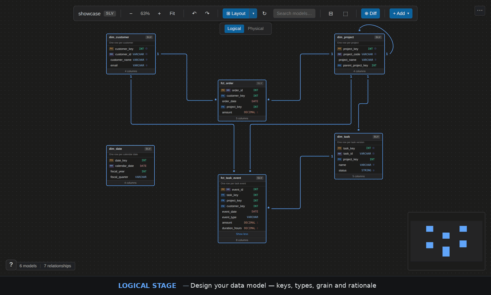

<p align="center">
  
</p>

<h1 align="center">ERD Studio</h1>

<p align="center">
  <strong>Design your data warehouse visually. Let AI build it.</strong>
</p>

<p align="center">
  <a href="https://marketplace.visualstudio.com/items?itemName=liamwynne.erd-studio"></a>
  <a href="https://marketplace.visualstudio.com/items?itemName=liamwynne.erd-studio"></a>
  <a href="https://marketplace.visualstudio.com/items?itemName=liamwynne.erd-studio"></a>
  <a href="https://github.com/liam-machine/erd-studio/blob/main/LICENSE"></a>
</p>

<p align="center">
  ERD Studio turns silver and gold layer modeling from a months-long slog<br>
  into days of focused design — powered by an AI coding harness<br>
  developed with and for <a href="https://claude.ai/code">Claude Code</a>.
</p>

<p align="center">
  <em>This extension was built almost entirely by Claude Code — from architecture to implementation.<br>
  The AI harness, reconciliation engine, and webview UI were all developed through<br>
  human-AI collaboration using Claude as the primary coding partner.</em>
</p>

<p align="center">
  
</p>

---

## The Problem

Data warehouse modeling is slow — not because the SQL is hard, but because the **design process** is scattered across whiteboards, Confluence pages, spreadsheets, and tribal knowledge. By the time you've documented a silver layer domain with 30+ models, weeks have passed and the docs are already stale.

**ERD Studio fixes this in three moves:**

> **1.** Design your data model visually on an interactive canvas inside VS Code
>
> **2.** Flip to the Physical stage to see what dbt actually built — spot gaps instantly
>
> **3.** Install the AI harness and let Claude Code generate the SQL, YAML, and tests

<br>

<table>
<tr>
<td width="50%">

**Without ERD Studio**

- Sketch ERDs on a whiteboard
- Hand-document in Confluence
- Write dbt YAML for every model by hand
- Reverse-engineer relationships from SQL
- Discover logical/physical drift months later
- Onboard new engineers with tribal knowledge

</td>
<td width="50%">

**With ERD Studio + AI**

- Design in VS Code with full column definitions
- Domain files *are* the docs — always current
- AI generates schema YAML from your design
- Drag-to-relate, AI writes the dbt tests
- Discrepancy overlay shows drift in real time
- Open the domain — the model is self-documenting

</td>
</tr>
</table>

---

## AI-First Design

ERD Studio ships with an **AI coding harness** — a schema reference that teaches your AI assistant the complete domain file format, naming conventions, model roles, and editing rules.

**One command:** <kbd>Cmd</kbd>+<kbd>Shift</kbd>+<kbd>P</kbd> &rarr; `dbt: Install AI Coding Harness`

<table>
<tr>
<th>Assistant</th>
<th>What Gets Installed</th>
</tr>
<tr>
<td><strong>Claude Code</strong></td>
<td><code>.claude/skills/erd-studio/SKILL.md</code> — full skill with progressive context + sync companion</td>
</tr>
<tr>
<td><strong>GitHub Copilot</strong></td>
<td><code>.github/instructions/erd-studio.instructions.md</code> — auto-applies to domain files</td>
</tr>
<tr>
<td><strong>Google Gemini</strong></td>
<td><code>.gemini/styleguide.md</code> — includes validation rules for code review</td>
</tr>
<tr>
<td><strong>OpenAI Codex</strong></td>
<td><code>AGENTS.md</code> — appended schema reference section</td>
</tr>
</table>

<br>

**What your AI can do once the harness is installed:**

- **Create models from scratch** — columns, data types, PK/FK/NK flags, SCD types, grain, rationale
- **Add models to domains** — correctly updates both domain JSON and model YAML
- **Generate dbt schema YAML** — writes `relationships` and `unique` tests that map directly to the physical stage
- **Execute sync reconciliation** — reads discrepancy reports and runs 26 action types to align logical and physical
- **Validate everything** — schema version, naming conventions (`dim_`, `fct_`, `brg_`, `ref_`), relationship rules
- **Preserve your layout** — knows not to touch `viewConfig.positions` when updating

> **Developed with and for Claude Code.** ERD Studio itself was built using Claude Code as the primary development tool — architecture, implementation, and testing were all driven through human-AI collaboration. The progressive skill loading and `SYNC.md` sync companion are purpose-built for Claude's skill system. Other assistants are fully supported — Claude Code is the reference implementation.

---

## Two-Stage Architecture

Every domain has two views of the same data model:

<table>
<tr>
<th width="15%">Stage</th>
<th width="10%">Color</th>
<th width="55%">What It Shows</th>
<th width="20%">Editable?</th>
</tr>
<tr>
<td><strong>Logical</strong></td>
<td>Blue</td>
<td>Your design intent — full column definitions, data types, PK/FK/NK badges, SCD types, grain, model roles, rationale</td>
<td>Yes</td>
</tr>
<tr>
<td><strong>Physical</strong></td>
<td>Green</td>
<td>What dbt actually built — auto-derived from <code>manifest.json</code>, relationships from dbt tests, cardinality from uniqueness tests</td>
<td>Positions only</td>
</tr>
</table>

<br>

Switch stages with the toolbar or <kbd>Alt</kbd>+<kbd>1</kbd> / <kbd>Alt</kbd>+<kbd>2</kbd>. Toggle the **discrepancy overlay** to see exactly where your design and warehouse diverge — extra columns, missing models, type mismatches, and cardinality differences are highlighted directly on the graph.

**The physical stage has no files on disk.** It's computed at runtime from `manifest.json`:

- **Models** = logical models that also exist in the manifest
- **Relationships** = derived from `relationships` / `relationships_where` test nodes (not from logical)
- **Cardinality** = inferred from `unique` and `unique_combination_of_columns` tests

<!-- TODO: Screenshot showing logical (blue) vs physical (green) stage comparison -->

---

## Reconciliation

The real power of the two-stage architecture is **reconciliation** — comparing your logical design against what dbt actually built, then fixing the drift automatically.

<table>
<tr>
<td width="40" align="center"><strong>1</strong></td>
<td><strong>Compare</strong> — toggle the discrepancy overlay to see where logical and physical diverge. Models, columns, relationships, data types, and cardinality are all checked. Types are normalized (e.g. <code>varchar</code> &rarr; <code>string</code>) to reduce noise.</td>
</tr>
<tr>
<td align="center"><strong>2</strong></td>
<td><strong>Choose ground truth</strong> — for each discrepancy, decide which side is authoritative. Is the logical design correct and physical needs updating? Or did the dbt model evolve and logical should catch up?</td>
</tr>
<tr>
<td align="center"><strong>3</strong></td>
<td><strong>Generate sync plan</strong> — the extension writes a <code>.sync-plan.json</code> with the concrete actions needed, including file paths to every affected YAML, SQL, and domain file.</td>
</tr>
<tr>
<td align="center"><strong>4</strong></td>
<td><strong>AI executes</strong> — Claude reads the plan and runs the actions: adding columns to YAML, writing dbt tests, updating domain JSON, removing stale relationships — whatever it takes to bring both stages into alignment.</td>
</tr>
</table>

**Sync action categories:**

| Target | Actions |
|--------|---------|
| **Models** | add / remove in either stage |
| **Columns** | add / remove / update data type in either stage |
| **Relationships** | add / remove relationship or dbt test / update cardinality in either stage |

The discrepancy overlay uses color-coded labels: `matched` `extra` `missing` `type-mismatch` `cardinality-mismatch`. Missing models appear as translucent "ghost nodes" on the canvas so you can see the full picture even when one side is incomplete.

> **Why this matters:** without reconciliation, logical designs and physical warehouses drift apart silently. ERD Studio makes drift visible and fixable in minutes, not days.

---

## Features

<table>
<tr>
<td width="50%" valign="top">

**Visual Modeling**

- Interactive ERD canvas with custom model nodes
- Drag-to-relate — long-press a column, drag to create FK relationships
- ELK auto-layout with manual repositioning (<kbd>Shift</kbd>+<kbd>L</kbd>)
- Model templates — dimension, fact, bridge, SCD2, blank
- Detail panel for columns, grain, rationale, model role

</td>
<td width="50%" valign="top">

**dbt Integration**

- Stream-parses `manifest.json` (handles 40MB+ files)
- Domain tagging — auto-tags dbt YAML with `domain:{name}`
- Run scoped builds: `dbt build --select tag:domain:customer-360`
- Tag reconciliation to fix drift between domains and YAML
- Physical relationships derived from dbt test nodes

</td>
</tr>
<tr>
<td width="50%" valign="top">

**Discrepancy Comparison**

- Cross-stage overlay with color-coded labels
- Status: `matched` `extra` `missing` `type-mismatch` `cardinality-mismatch`
- Ghost nodes for missing models (translucent)
- Sync reconciliation via AI (26 action types)

</td>
<td width="50%" valign="top">

**Organization**

- Medallion layers — bronze, silver, gold, platinum, custom
- Domain scoping prevents conformed dims from pulling in the full graph
- Full undo/redo via VS Code `WorkspaceEdit`
- Central model store — one YAML per model, referenced across domains

</td>
</tr>
</table>

---

## Getting Started

**Prerequisites:** VS Code 1.85+ &bull; a dbt project with `dbt_project.yml` &bull; `manifest.json` in `target/`

<table>
<tr>
<td width="40" align="center"><strong>1</strong></td>
<td><strong>Open your dbt project</strong> in VS Code — the extension activates on <code>dbt_project.yml</code></td>
</tr>
<tr>
<td align="center"><strong>2</strong></td>
<td><strong>Click the ERD Studio icon</strong> in the Activity Bar</td>
</tr>
<tr>
<td align="center"><strong>3</strong></td>
<td><strong>Initialize the directory</strong> — follow the prompt to create the <code>erd-studio/</code> folder</td>
</tr>
<tr>
<td align="center"><strong>4</strong></td>
<td><strong>Create a domain</strong> — <kbd>Cmd</kbd>+<kbd>Shift</kbd>+<kbd>P</kbd> &rarr; <code>dbt: Create Semantic Domain</code></td>
</tr>
<tr>
<td align="center"><strong>5</strong></td>
<td><strong>Design</strong> — right-click to add models, define columns in the detail panel, drag to relate</td>
</tr>
<tr>
<td align="center"><strong>6</strong></td>
<td><strong>Install the AI harness</strong> — <kbd>Cmd</kbd>+<kbd>Shift</kbd>+<kbd>P</kbd> &rarr; <code>dbt: Install AI Coding Harness</code></td>
</tr>
</table>

---

## Directory Structure

```
erd-studio/
├── layers.json              # layer config
├── templates/               # custom model templates (optional)
├── logical-models/          # one YAML per model (central store)
│   ├── dim_customer.yml
│   └── fct_orders.yml
├── silver/
│   ├── customer-360.json    # domain file
│   └── orders.json
└── gold/
    └── reporting.json
```

Domain files are JSON — they reference models and define relationships. Model definitions are YAML — they hold columns, types, and metadata. The AI harness teaches your assistant exactly which file to edit for any task.

---

## Physical Cardinality

ERD Studio derives physical relationships from dbt test nodes. Cardinality is inferred from uniqueness tests:

| FK has `unique`? | PK has `unique`? | Cardinality |
|:---:|:---:|---|
| No | Yes | `many-to-one` |
| Yes | Yes | `one-to-one` |
| Yes | No | `one-to-many` |
| No | No | `many-to-many` |

No `unique` test = "many" side. Composite keys via `unique_combination_of_columns` are supported.

```yaml
# Add a unique test to make this side "one"
models:
  - name: dim_customer
    columns:
      - name: customer_id
        tests:
          - unique
          - not_null
```

---

## Settings

| Setting | Description | Default |
|---------|-------------|---------|
| `dbtSemantic.projectPath` | Path to dbt project root | Auto-detected |
| `dbtSemantic.semanticDir` | Relative path to domain files | `erd-studio` |

---

## Contributors

<table>
<tr>
<td align="center"><a href="https://github.com/jkweee"><br><sub><b>Jason Kwe</b></sub></a><br><sub>Core concept, UI/UX</sub></td>
<td align="center"><a href="https://github.com/ginny-jhg"><br><sub><b>Ginny</b></sub></a><br><sub>Auto-layout, depth partitioning</sub></td>
</tr>
</table>

---

<p align="center">
  <sub>MIT License &bull; Made for the dbt community</sub>
</p>
